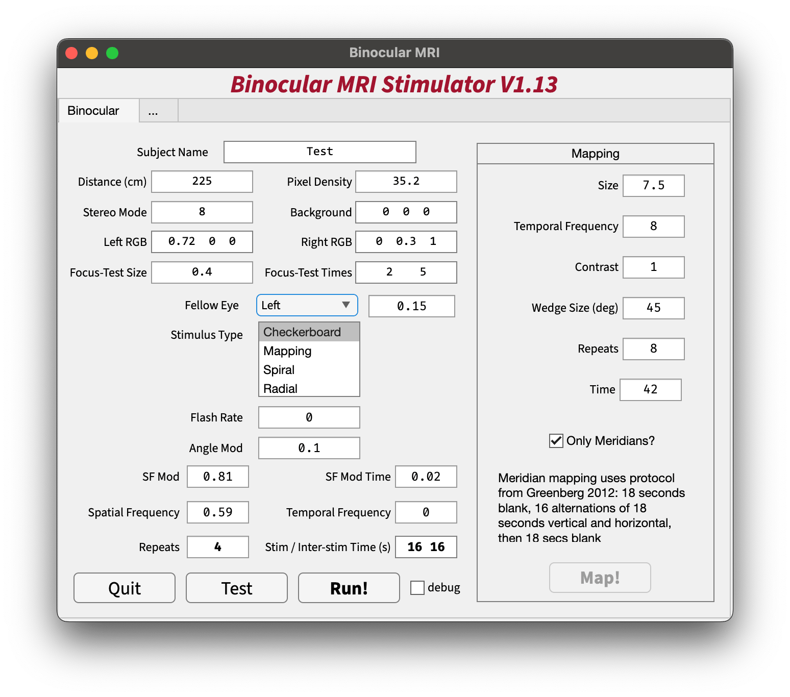

# Binocular MRI Testing

Stereo stimulation for MRI testing of visual response during MRI, includes fast meridian mapping stimuli.

Please install [Opticka](https://github.com/iandol/opticka) and PTB in MATLAB as this code depends on it. PTB strongly recommends Linux and AMD GPUs for stable and reliable data collection. Clone this repo and add the folder to the MATLAB path.

## Dependencies

- [Opticka](https://github.com/iandol/opticka)
- [Psychtoolbox](https://www.psychtoolbox.org/)

## Usage

Run `binocularMRI` in MATLAB to show the GUI:

## License

MIT License

Copyright (c) 2024 Cognition & Behaviour Platform

