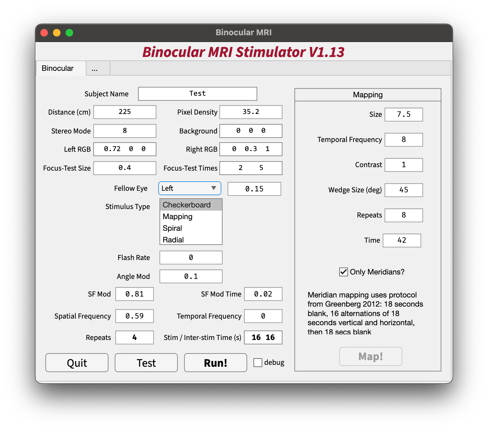

# Binocular MRI Testing

Published at:

Huang Y, Wang S, Qian Y, Kong L, Zhao P, Liu Y, Zarei SA, Zhang P, Andolina IM, & Liu H (2026) “Differential Effects of Balanced and Imbalanced Binocular Stimulation on Visual Cortex Responses in Amblyopic Children” Clinical Ophthalmology 20, 1-16 [doi.org/10.2147/opth.s590186](https://doi.org/10.2147/opth.s590186)

Stereo stimulation for MRI testing of visual response during MRI, includes fast meridian mapping stimuli.

Please install [Opticka](https://github.com/iandol/opticka) and PTB in MATLAB as this code depends on it. PTB strongly recommends Linux and AMD GPUs for stable and reliable data collection. Clone this repo and add the folder to the MATLAB path.

## Dependencies

- [Opticka](https://github.com/iandol/opticka)
- [Psychtoolbox](https://www.psychtoolbox.org/)

## Usage

Run `binocularMRI` in MATLAB to show the GUI:

## License

MIT License

Copyright (c) 2024 Cognition & Behaviour Platform

